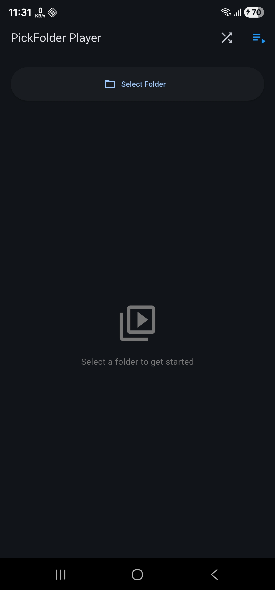

# PickFolder Player

A privacy-focused Flutter video player app for Android with **specific folder selection** - the most secure way to manage your video library!

## Why PickFolder Player?

**Most video players force you to grant access to ALL your files and folders!**

Unlike traditional video players that require complete storage access (potentially exposing all your private files), **PickFolder Player** uses Android's Storage Access Framework (SAF) to let you:

- **Select ONLY specific folders** you want to play videos from  
- **Keep your privacy intact** - No access to your documents, photos, or other folders  
- **Better security** - The app can only see what you explicitly allow  
- **No broad storage permissions** - Works with Android's modern scoped storage

**This is the ONLY video player that prioritizes your privacy by requesting access to specific folders only!**

---

## Features

- **Secure Folder Selection**: Select specific folders using Android's built-in folder picker
- **Shuffle Mode**: Randomize video playback order with one tap
- **Autoplay**: Automatically play the next video in the queue
- **Full-Featured Player**: Professional video player with:
  - Play/Pause controls
  - Seek bar with scrubbing
  - Previous/Next video navigation
  - Time display
  - Tap to show/hide controls
- **Persistent Settings**: Remembers your folder selection, shuffle, and autoplay preferences
- **Modern UI**: Clean, Material Design 3 interface
- **Dark Theme**: Easy on the eyes

---

## Screenshots

<p align="center">
  
  
</p>

_Privacy-focused video player with folder selection and playback controls_

---

## Getting Started

### For Users

1. Download the APK from [Releases](https://github.com/AnikKazi-dev/PickFolder-Video-Player-Android-/releases)
2. Install the app on your Android device
3. Open the app and tap "Select Folder"
4. Choose the folder containing your videos
5. Enjoy your videos with privacy and security!

### For Developers

**Prerequisites:**

- Flutter SDK (3.0 or higher)
- Android SDK (API level 21+)
- Android Studio or VS Code

**Setup:**

```bash
# Clone the repository
git clone https://github.com/AnikKazi-dev/PickFolder-Video-Player-Android-.git

# Navigate to project directory
cd PickFolder-Video-Player-Android-

# Install dependencies
flutter pub get

# Run the app
flutter run
```

---

## Requirements

- **Android**: 5.0 (API level 21) or higher
- **Flutter**: 3.0 or higher
- **Dart**: 3.0 or higher

---

## Permissions

The app uses minimal permissions:

- `READ_MEDIA_VIDEO` - To read video files (Android 13+)
- `READ_EXTERNAL_STORAGE` - To read video files (Android 12 and below)

**No broad storage access required!** The app uses Android's Storage Access Framework (SAF) for secure, folder-specific access.

---

## Built With

- [Flutter](https://flutter.dev/) - UI framework
- [video_player](https://pub.dev/packages/video_player) - Video playback
- [file_picker](https://pub.dev/packages/file_picker) - Folder selection
- [shared_preferences](https://pub.dev/packages/shared_preferences) - Settings persistence
- [permission_handler](https://pub.dev/packages/permission_handler) - Permission management

---

## Supported Video Formats

- MP4, MKV, AVI
- MOV, WMV, FLV
- WebM, M4V, 3GP
- MPEG, MPG

---

## Contributing

Contributions are welcome! Feel free to:

1. Fork the project
2. Create your feature branch (`git checkout -b feature/AmazingFeature`)
3. Commit your changes (`git commit -m 'Add some AmazingFeature'`)
4. Push to the branch (`git push origin feature/AmazingFeature`)
5. Open a Pull Request

---

## License

This project is licensed under the MIT License - see the [LICENSE](LICENSE) file for details.

---

## Author

**Anik Kazi**

- GitHub: [@AnikKazi-dev](https://github.com/AnikKazi-dev)

---

## Support

If you find this app useful, please consider giving it a star on GitHub!

---

## Contact & Issues

Found a bug or have a feature request? Please open an [issue](https://github.com/AnikKazi-dev/PickFolder-Video-Player-Android-/issues).

---

**Made with Flutter**
